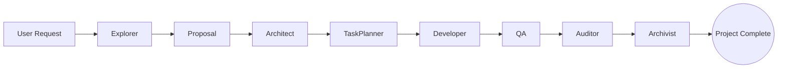

# DevHive MCP Server

[](https://www.python.org/)
[](https://modelcontextprotocol.io/)
[](https://opensource.org/licenses/MIT)

**DevHive** is a powerful **Model Context Protocol (MCP)** server that orchestrates an autonomous AI software development team. It transforms a single LLM session into a sequential, multi-agent pipeline capable of handling complex software engineering tasks—from initial requirements analysis to final code archiving.

Designed to integrate seamlessly with **OpenCode** and **GitHub Copilot**, DevHive provides the tooling and state management necessary for AI agents to work continuously on large projects without losing context.

---

## 🚀 Key Features

*   **8-Stage Agent Pipeline:** A structured workflow guiding development through specialized roles:
    1.  **Explorer:** Analyzes requirements and feasibility.
    2.  **Proposal:** Creates detailed feature proposals.
    3.  **Architect:** Designs technical architecture and system diagrams.
    4.  **TaskPlanner:** Breaks down work into actionable developer tasks.
    5.  **Developer:** Implements code and writes files.
    6.  **QA:** Generates and executes test suites.
    7.  **Auditor:** Verifies consistency against architecture and requirements.
    8.  **Archivist:** Finalizes and archives the project state.
*   **Persistent State Management:** Tracks project progress, artifacts, and file generation across sessions.
*   **Context Optimization (RAG):** Built-in memory system using TF-IDF to retrieve relevant context from previous steps, reducing token usage and hallucination.
*   **Cross-Platform CLI:** Easy-to-use command-line interface for configuration and server management.
*   **Universal Compatibility:** Works as a local MCP server for OpenCode, Claude Desktop, or any MCP-compliant client.

---

## 🛠 Architecture

DevHive operates on a strictly sequential pipeline model. Each agent produces a specific **Artifact** (JSON document) that serves as the input for the next agent.



### Core Components

*   **`mcp_server`**: The main Python package containing the server logic.
*   **`TaskOrchestrator`**: Manages the transition between agents and validates outputs.
*   **`MemoryStore`**: A local vector-lite store (TF-IDF) for semantic search over project history.
*   **`ProjectStateManager`**: Persists project status to `project_state.json`.

---

## 📦 Installation

### Prerequisites

*   Python 3.10 or higher
*   `pip`

### Install from Source

Clone the repository and install the package in editable mode:

```bash
git clone https://github.com/yourusername/devhive.git
cd devhive
pip install -e .
```

This installs the `devhive` CLI tool globally in your environment.

---

## ⚙️ Configuration

DevHive includes a smart configuration tool that sets up your environment automatically.

### 1. Run the Setup Wizard

```bash
devhive configure
```

The wizard will ask:
*   **Client Selection:** OpenCode, GitHub Copilot (VS Code), or both.
*   **MCP Server Registration:** For OpenCode users, it can automatically add the DevHive server to your `config.json`.
*   **VS Code Integration:** For Copilot users, it injects the agent system prompts directly into your global VS Code settings (`github.copilot.chat.codeGeneration.instructions`).

### 2. Manual Configuration (Optional)

If you prefer manual setup:

**OpenCode (`~/.config/opencode/opencode.json`):**
```json
{
  "mcp": {
    "devhive": {
      "type": "local",
      "command": ["python3", "-m", "mcp_server.server"],
      "enabled": true,
      "env": { "PYTHONUNBUFFERED": "1" }
    }
  }
}
```

**VS Code (`settings.json`):**
```json
"github.copilot.chat.codeGeneration.instructions": [
    {
        "file": "/path/to/devhive/DEVHIVE_AGENT.md"
    }
]
```

---

## 🖥 Usage

### Starting the Server

To start the MCP server locally (useful for debugging or manual connection):

```bash
devhive start
```

*Note: If configured correctly in OpenCode, the server starts automatically in the background.*

### Workflow with AI Clients

1.  **Open your AI Client** (OpenCode or VS Code Copilot).
2.  **Initialize a Project:**
    Ask the agent: *"Start a new pipeline for a CSV export feature."*
    
    The agent will use `devhive_start_pipeline`.
3.  **Follow the Steps:**
    The AI will automatically assume the role of the **Explorer**.
    *   It will analyze the request.
    *   It will submit its findings using `devhive_submit_result`.
4.  **Iterate:**
    DevHive will return the prompt for the next agent (Proposal). The AI client will switch roles and continue until the **Archivist** declares the project complete.

---

## 📚 API / Tool Reference

The server exposes the following MCP tools to the AI agent:

| Tool | Description |
|------|-------------|
| `devhive_start_pipeline` | Initializes a project and retrieves the first task (Explorer). |
| `devhive_submit_result` | Submits work from the current agent, saves artifacts, and retrieves the next task. |
| `devhive_search_memory` | Searches project history/context using semantic query. |
| `devhive_get_recent_memories` | Retrieves the most recent interactions for context refreshment. |
| `devhive_get_memory_stats` | Returns usage statistics for the project memory. |
| `list_workspace_files` | Lists files in the current working directory. |
| `read_workspace_file` | Reads content of a specific file. |

---

## 📂 Project Structure

```text
devhive/
├── DEVHIVE_AGENT.md       # The "Brain" - System prompt for the AI agent
├── AGENTS.md              # Documentation for agent roles
├── pyproject.toml         # Python project configuration
├── setup.py               # Legacy setup support
├── mcp_server/            # Source code
│   ├── agents/            # Logic for individual agents (Explorer, Developer, etc.)
│   ├── core/              # Core infrastructure (LLM, Memory, State)
│   ├── utils/             # Filesystem and validation utilities
│   ├── cli.py             # CLI implementation (devhive command)
│   └── server.py          # FastMCP server entry point
└── tests/                 # Test suite
```

---

## 🧪 Development

### Running Tests

DevHive uses `pytest` for testing.

```bash
# Install test dependencies
pip install pytest

# Run all tests
pytest
```

### Adding a New Agent

1.  Create a new class in `mcp_server/agents/` inheriting from `BaseAgent`.
2.  Define the agent's specific validation logic in `mcp_server/utils/validation.py`.
3.  Register the agent in `mcp_server/server.py` and `mcp_server/core/task_orchestrator.py`.
4.  Update `DEVHIVE_AGENT.md` to include the new role in the pipeline instructions.

---

## 🤝 Contributing

Contributions are welcome! Please follow these steps:

1.  Fork the repository.
2.  Create a feature branch (`git checkout -b feature/amazing-feature`).
3.  Commit your changes (`git commit -m 'Add some amazing feature'`).
4.  Push to the branch (`git push origin feature/amazing-feature`).
5.  Open a Pull Request.

Please ensure all tests pass and your code follows the existing style conventions (Python 3.10+ type hinting).

---

## 📄 License

This project is licensed under the MIT License - see the [LICENSE](LICENSE) file for details.
